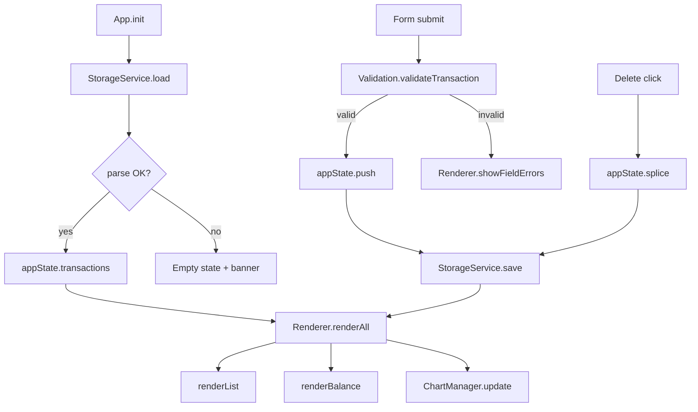

# Design Document: Expense & Budget Visualizer

## Overview

The Expense & Budget Visualizer is a client-side-only single-page application (SPA) built with plain HTML, CSS, and vanilla JavaScript — no frameworks, no build tools, no backend. All data lives in `localStorage`. The app renders four primary sections in one page:

1. **Input Form** — enter and validate new transactions
2. **Balance Display** — running total of all amounts
3. **Transaction List** — reverse-insertion list with per-item delete
4. **Pie Chart** — spending distribution via Chart.js (CDN)

The design prioritises simplicity and zero external tooling: one HTML file, one CSS file (`css/styles.css`), and one JavaScript file (`js/app.js`). Chart.js 4.x is loaded from a CDN `<script>` tag.

### Goals

- Instant feedback on every user action (add, delete) with no page reload
- Graceful degradation when `localStorage` is unavailable or data is corrupted
- Accessible and responsive layout from 320 px to 1920 px
- All logic in `js/app.js` with clearly separated pure functions and DOM side-effects

---

## Architecture

The application follows a **unidirectional data flow** pattern entirely within a single JS file:

```
User Action
    │
    ▼
Input Validation (pure functions)
    │
    ▼
State Mutation  ──► localStorage.setItem(serialized state)
    │
    ▼
Re-render (DOM + Chart)
```

There is one canonical in-memory state object (`appState`) that the renderer reads. Every user action goes through:

1. **Validation** — pure functions that return `{ valid, errors }`
2. **State update** — mutate `appState.transactions`
3. **Persistence** — `StorageService.save(appState.transactions)`
4. **Render** — `render()` reconciles the DOM and calls `chart.update()`

No virtual DOM or diffing is needed at this scale; the transaction list and chart are fully re-rendered on each state change.

### Module Boundaries (within `js/app.js`)

All code lives in one file, organised into clearly delimited plain function groups:

| Section | Responsibility |
|---|---|
| `StorageService` | `load()`, `save()`, `isAvailable()` — all `localStorage` access |
| `Validation` | `validateTransaction(formData)` — pure, no DOM access |
| `Formatters` | `formatCurrency(amount)`, `formatPercent(value)` — pure |
| `ChartManager` | Create, update, destroy the Chart.js instance |
| `Renderer` | Build/update DOM nodes for list, balance, error banners |
| `EventHandlers` | Form submit, delete clicks — glue between UI and state |
| `App.init()` | Bootstrap: load state, render, attach events |



---

## Components and Interfaces

### `StorageService`

```js
const StorageService = {
  KEY: 'expense_visualizer_transactions',

  // Returns true if localStorage read/write works
  isAvailable() { ... },

  // Returns { transactions: Transaction[], corrupt: boolean }
  // Returns [] on parse failure; sets corrupt = true
  load() { ... },

  // Writes JSON to localStorage; returns true on success, false if unavailable
  save(transactions) { ... },
};
```

### `Validation`

```js
const Validation = {
  // Returns { valid: true } or
  // { valid: false, errors: { name?, amount?, category? } }
  validateTransaction(formData) { ... },

  // Pure helper: is value a finite number in [0.01, 999999.99]?
  isValidAmount(value) { ... },
};
```

### `Formatters`

```js
const Formatters = {
  // "$1,234.56" or "-$50.00" — uses Intl.NumberFormat
  formatCurrency(amount) { ... },

  // "42.3%" — one decimal place
  formatPercent(value) { ... },
};
```

### `ChartManager`

```js
const ChartManager = {
  _instance: null,

  // Creates Chart.js instance bound to <canvas id="spending-chart">
  init(canvas) { ... },

  // Recalculates category totals from transactions and calls chart.update()
  update(transactions) { ... },

  // Replaces chart with a single grey "No data" placeholder segment
  showPlaceholder() { ... },
};
```

### `Renderer`

```js
const Renderer = {
  renderList(transactions)  { ... },
  renderBalance(transactions) { ... },
  showFieldErrors(errors)   { ... },
  clearFieldErrors()        { ... },
  showBanner(message, type) { ... }, // type: 'error' | 'info'
  clearBanner()             { ... },
  resetForm()               { ... },
};
```

### `EventHandlers`

```js
const EventHandlers = {
  onFormSubmit(event)          { ... },
  onDeleteClick(event, id)     { ... },
};
```

---

## Data Models

### `Transaction`

```js
{
  id: string,        // crypto.randomUUID() or Date.now().toString() fallback
  name: string,      // 1–100 characters, trimmed
  amount: number,    // float, 0.01–999999.99
  category: string,  // 'Food' | 'Transport' | 'Fun'
  createdAt: number, // Date.now() timestamp for ordering
}
```

### `AppState` (in-memory only, never serialised directly)

```js
{
  transactions: [],        // Transaction[]; source of truth
  storageAvailable: true,  // boolean
  bannerShown: false,      // prevents duplicate storage-unavailable banner
}
```

### `ValidationResult`

```js
{ valid: true }
// or
{ valid: false, errors: { name?: string, amount?: string, category?: string } }
```

### `CategoryTotals` (computed, never persisted)

```js
{ Food: number, Transport: number, Fun: number }
```

### LocalStorage Schema

- **Key**: `expense_visualizer_transactions`
- **Value**: JSON-serialised `Transaction[]`

```json
[
  {
    "id": "1700000000000",
    "name": "Coffee",
    "amount": 4.50,
    "category": "Food",
    "createdAt": 1700000000000
  }
]
```

### HTML Structure (skeleton)

```html
<body>
  <header>
    <h1>Expense &amp; Budget Visualizer</h1>
  </header>
  <div id="banner" role="alert" aria-live="polite" hidden></div>
  <main>
    <section id="balance-section">
      <h2>Total Balance</h2>
      <p id="balance-display">$0.00</p>
    </section>
    <section id="form-section">
      <h2>Add Transaction</h2>
      <form id="transaction-form">
        <label for="item-name">Item name</label>
        <input id="item-name" type="text" maxlength="100" required />
        <span class="field-error" id="name-error"></span>

        <label for="amount">Amount ($)</label>
        <input id="amount" type="number" step="0.01" min="0.01" max="999999.99" required />
        <span class="field-error" id="amount-error"></span>

        <label for="category">Category</label>
        <select id="category" required>
          <option value="">Select…</option>
          <option value="Food">Food</option>
          <option value="Transport">Transport</option>
          <option value="Fun">Fun</option>
        </select>
        <span class="field-error" id="category-error"></span>

        <button type="submit">Add Transaction</button>
      </form>
    </section>
    <section id="chart-section">
      <h2>Spending by Category</h2>
      <canvas id="spending-chart" aria-label="Pie chart of spending by category" role="img"></canvas>
    </section>
    <section id="list-section">
      <h2>Transactions</h2>
      <ul id="transaction-list"></ul>
    </section>
  </main>
</body>
```

### Chart.js Integration

Chart.js 4.x is loaded via CDN before `js/app.js`:

```html
<script src="https://cdn.jsdelivr.net/npm/chart.js@4/dist/chart.umd.min.js"></script>
<script src="js/app.js"></script>
```

Pie chart creation:

```js
new Chart(canvas, {
  type: 'pie',
  data: {
    labels: ['Food', 'Transport', 'Fun'],
    datasets: [{
      data: [foodTotal, transportTotal, funTotal],
      backgroundColor: ['#f97316', '#3b82f6', '#a855f7'],
    }]
  },
  options: {
    responsive: true,
    plugins: {
      legend: { display: true, position: 'bottom' },
      tooltip: {
        callbacks: {
          label: (ctx) => `${ctx.label}: ${Formatters.formatPercent(ctx.parsed / total * 100)}`
        }
      }
    }
  }
});
```

When all totals are zero, `ChartManager.showPlaceholder()` replaces data with `[1]`, label `['No data']`, and a neutral grey colour, preventing Chart.js from rendering an empty chart.

---

## Correctness Properties

*A property is a characteristic or behavior that should hold true across all valid executions of a system — essentially, a formal statement about what the system should do. Properties serve as the bridge between human-readable specifications and machine-verifiable correctness guarantees.*

### Property 1: Amount Validation Boundary

*For any* string input, `Validation.isValidAmount` shall return `true` if and only if the string parses to a finite number within the closed interval [0.01, 999999.99], and `false` for all other inputs — including non-numeric strings, zero, negative values, values above the maximum, and values with invalid decimal formats.

**Validates: Requirements 1.1, 1.4**

---

### Property 2: Valid Transaction Add Grows the List

*For any* valid transaction input (non-empty name ≤ 100 characters, amount in [0.01, 999999.99], category in {Food, Transport, Fun}), adding it to a transaction array of length N must produce an array of length N+1 that contains the new transaction with all fields intact.

**Validates: Requirements 1.2**

---

### Property 3: Empty or Whitespace Fields Are Rejected

*For any* transaction input where at least one field (name, amount, or category) is empty, undefined, or composed entirely of whitespace characters, `Validation.validateTransaction` shall return `{ valid: false }` and no transaction shall be added to the list.

**Validates: Requirements 1.3**

---

### Property 4: Currency Formatting Invariant

*For any* finite number `n`, `Formatters.formatCurrency(n)` shall produce a string where:
- Non-negative values start with `$`; negative values start with `-$`
- The fractional part is exactly 2 digits following a `.`
- Integer parts ≥ 1000 use comma-separated thousands groups (e.g., `1,234`)

**Validates: Requirements 2.1, 4.1**

---

### Property 5: Serialization Round-Trip

*For any* array of valid `Transaction` objects, serialising with `JSON.stringify` then deserialising with `JSON.parse` shall produce an array where each element has identical `id`, `name`, `amount`, `category`, and `createdAt` values as the original.

**Validates: Requirements 2.3, 6.1, 6.3**

---

### Property 6: Reverse Insertion Order

*For any* non-empty array of transactions with distinct `createdAt` timestamps, when sorted for rendering, the transaction with the greatest `createdAt` value shall appear first (descending order), and every subsequent transaction shall have a `createdAt` value less than or equal to its predecessor.

**Validates: Requirements 2.4**

---

### Property 7: Balance Equals Sum of Amounts

*For any* array of transactions (including the empty array), the computed balance shall equal the exact arithmetic sum of all `amount` values. For an empty array the balance shall be `0`. This invariant holds after every add and every delete operation.

**Validates: Requirements 3.3, 4.1, 4.2, 4.3, 4.4**

---

### Property 8: Category Totals Are Partitioned and Sum to Total

*For any* array of transactions, `computeCategoryTotals` shall return an object where each category's value equals the sum of `amount` for all transactions in that category, and the sum of all three category values equals the total sum of all transaction amounts — no amount is double-counted or dropped.

**Validates: Requirements 5.1, 5.3**

---

### Property 9: Percentage Formatting Invariant

*For any* numeric value `p` representing a percentage (e.g., 42.3), `Formatters.formatPercent(p)` shall produce a string consisting of the value rounded to exactly one decimal place followed immediately by `%` (e.g., `"42.3%"`).

**Validates: Requirements 5.6**

---

## Error Handling

### LocalStorage Unavailability

`StorageService.isAvailable()` performs a test write/read/delete at startup. If this fails (e.g., `SecurityError`, `QuotaExceededError`), `appState.storageAvailable` is set to `false`.

- **On save/delete**: `StorageService.save()` returns `false`; the caller renders an inline operation-level error message.
- **On load**: returns `{ transactions: [], corrupt: false }`; the app shows the storage-unavailable banner exactly **once** per session (tracked by `appState.bannerShown`).

### Corrupted or Malformed Data

During `App.init()`, if `JSON.parse` throws or the parsed value is not an array, the app:
1. Discards the corrupt value
2. Initialises `appState.transactions = []`
3. Shows a non-blocking warning banner: *"Previously saved data could not be loaded. Starting fresh."*

### Validation Errors

Inline error messages are placed in `<span class="field-error">` elements adjacent to each input, with IDs `name-error`, `amount-error`, `category-error`. They are cleared before each submission and re-populated based on `ValidationResult.errors`. The transaction is not added when any error is present.

### Chart Library Load Failure

If Chart.js fails to load from CDN, `typeof Chart === 'undefined'` is checked at `App.init()`. The chart section then renders a fallback text: *"Chart unavailable — please check your internet connection."*

### Error Feedback Summary

| Scenario | Location | Behaviour |
|---|---|---|
| Empty / invalid form field | Inline, adjacent to field | Field-level `<span>` error text |
| localStorage unavailable (add/delete) | Inline below form or list | Operation-level error text |
| localStorage unavailable (on load) | Page-level banner (once per session) | Non-blocking banner |
| Corrupted localStorage data | Page-level banner | Non-blocking banner + empty state |
| Chart.js CDN failure | Inside `#chart-section` | Static fallback text |

---

## Testing Strategy

No test framework setup is required for this project. All verification is done manually in the browser using the browser's built-in DevTools console and inspector.

### Manual Verification Approach

The pure functions in `js/app.js` (`Validation`, `Formatters`, `StorageService`, `calculateBalance`, `computeCategoryTotals`) are designed to be callable directly from the browser console for spot-checking. No module bundler or test runner is needed.

### Correctness Properties (Manual Spot-Check Guide)

The nine properties in the Correctness Properties section above define the formal correctness guarantees for the app. Each can be manually verified by:

1. Opening the app in a browser and opening DevTools (`F12`)
2. Calling the relevant pure function directly in the console with representative inputs
3. Inspecting the return value against the property's expected behaviour

**Example console checks:**

```js
// Property 1 — amount validation boundaries
Validation.isValidAmount('0.01')     // true
Validation.isValidAmount('999999.99') // true
Validation.isValidAmount('0')        // false
Validation.isValidAmount('abc')      // false

// Property 4 — currency formatting
Formatters.formatCurrency(1234.56)   // "$1,234.56"
Formatters.formatCurrency(-50)       // "-$50.00"

// Property 7 — balance equals sum
calculateBalance([{ amount: 10 }, { amount: 5.5 }]) // 15.5

// Property 9 — percentage formatting
Formatters.formatPercent(42.3)       // "42.3%"
```

### Browser Compatibility

The app must be manually verified to load and function correctly in:

| Browser | Minimum supported version |
|---|---|
| Chrome | Latest stable |
| Firefox | Latest stable |
| Edge | Latest stable |
| Safari | Latest stable (macOS / iOS) |

Verify in each browser: form submission, delete, balance update, chart render, and localStorage persistence across a page reload.

### Scenario Checklist

The following scenarios should be walked through manually to confirm correct behaviour:

| Scenario | Expected Result |
|---|---|
| Submit form with all valid fields | Transaction appears at top of list; balance updates; chart updates |
| Submit form with empty name field | Inline error shown; no transaction added |
| Submit form with amount `0` or `abc` | Inline error shown next to amount field |
| Delete a transaction | Transaction removed; balance and chart update immediately |
| Reload the page after adding transactions | All transactions restored; balance and chart match stored data |
| Open app with no prior transactions | Empty state message shown in list; `$0.00` balance; chart shows placeholder |
| Resize browser to 320 px wide | All sections stack vertically; no horizontal scrollbar |
| Resize browser to 1920 px wide | Layout remains usable; no overflow |
| Open app with corrupted localStorage value | Non-blocking banner shown; app starts in empty state |
